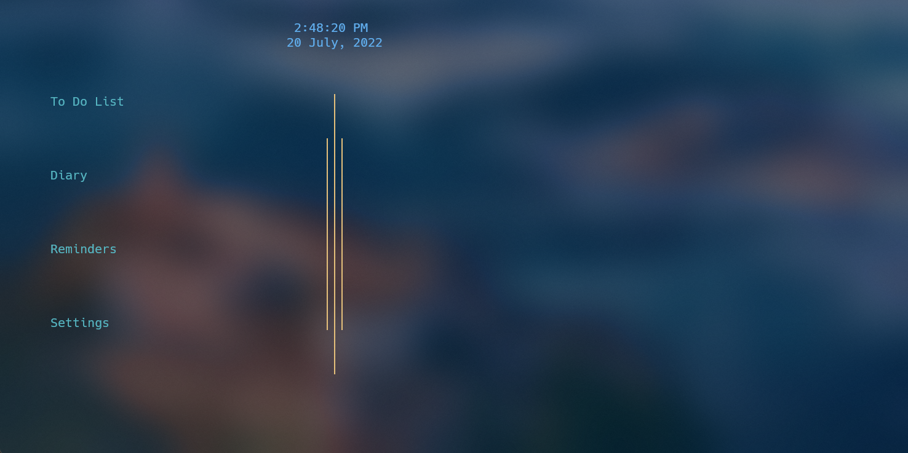

<!-- 
 -->

# Diary &amp; To-Do App
**A terminal based diary & to-do app using only c++**

## User's Interface

  

## Keybindings

- Up/down arrow key to scroll
- Enter key to select
- Esc key to back/exit
- D key to delete

<!-- 
 -->
